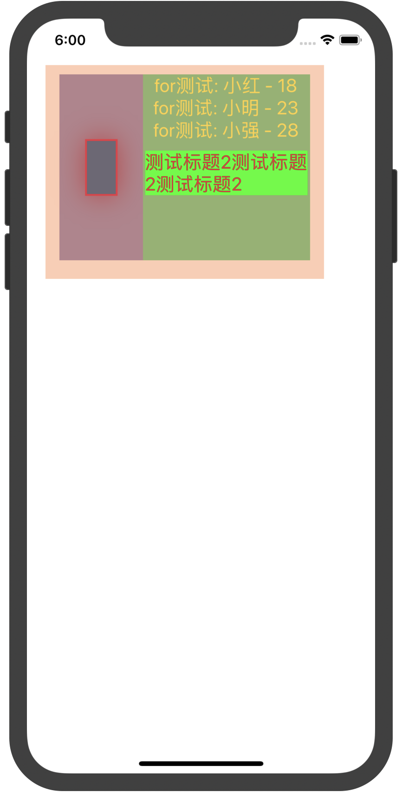
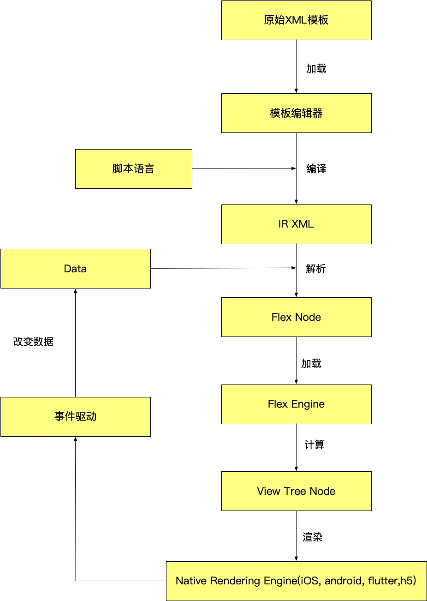
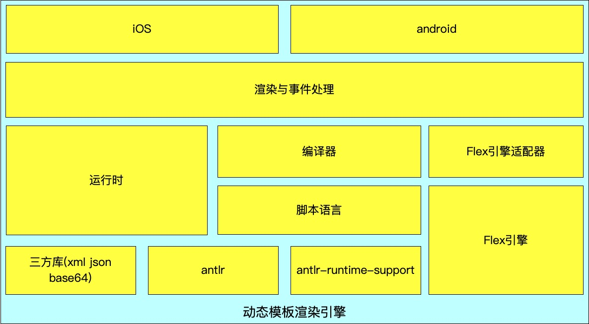

# Dynamic DSL(DDSL)

##### Dynamic DSL是一个精简的动态布局模板,基于Antlr实现了一门简单的脚本语言,通过脚本语言的运算可以实现布局描述文件动态化,再结合Flex布局引擎(Yoga)计算出最终的渲染视图树。

### 最终展示效果:
###### 这是一个简单的渲染效果图,for测试通过自定义脚本实现了元素的重复,无数展示的数据通过动态绑定生成,原始的渲染XML如下:
```
<?xml version="1.0"?>
<View flexDirection="row" width="300" height="auto"
    maxHeight="1000"
    left="20"
    top="50"
    justify="spaceAround"
    alignItems="stretch"
    paddingTop="10"
    paddingBottom="20"
    paddingLeft="15"
    paddingRight="15"
    backgroundColor="#FFCDB2">
    <View flex="2" height="auto" justify="center" alignItems="center" backgroundColor="#B5838D">
        <View width="{{ 50 / 2 + 10 }}"
            height="{{ 59 + 2.5 *2 -3 }}"
            backgroundColor="#6D6875"
            borderColor="#e63946"
            borderWidth="2"
            shadowColor="#d00000"
            shadowRadius="15"
            shadowOpacity="0.5"
            ></View>
    </View>
    <View flex="2" height="200" backgroundColor="#90B36D" justify="start" alignItems="center">
        <Label text="for测试: {{item[name]}} - {{ item[age] }}" fontSize="20" color="#ffd23f" for="{{ for item in items }}"></Label>
        <Label text="测试标题2测试标题2测试标题2"
            fontSize="20"
            color="#ef233c"
            marginTop="10"
            lineNumber="3"
            backgroundColor="#00ff00"></Label>
    </View>
</View>

```



### 渲染流程图:



### 引擎架构:


### 模块介绍
`Runtime`:  实现了脚本的语义分析,模板实现了一个栈帧。已经实现的运算有(一元表达式、二元表达式、三元表达式、链式取值、加减乘除、取余、逻辑运算，for语句、if语句)

`Libs `: 三方库

`Antlr`:  antlr运行时库(这里需要注意的是: antlr运行时支持挺大,所以在流程中设计了IR XML语言,在模板编辑器中将原始模板通过antlr编译成IR 模板,runtime运行时解析IR不再需要antlr支持)

`Script`: antlr语法文件支持库,通过g4文件生成的用于解析相关词法与语法的库

`Compiler`:  IR编译与动态模板解析支持

`Flex`: Yoga库与在此基础上抽象出来的节点与属性配置

`iOS`: iOS平台的一个Demo实现

### 使用DDSL的关键代码
`目前的代码仅实现了功能,还没有实现模板编辑器,生成IR XML的功能使用测试用例代替`

#### 生成IR XML
```
NSBundle *bundle = [NSBundle bundleForClass:[self class]];
NSString *xmlPath = [bundle pathForResource:@"node" ofType:@"xml"];
auto db = DDIR([xmlPath UTF8String]);
cout << db.ObtainXMLIR() << endl;
```
#### iOS端加载IR XML实现布局
```
vector<shared_ptr<DDSL::SemaASTNodeObject>> images;
images.push_back(make_shared<DDSL::SemaASTNodeObject>("http:///www.jd.com/"));
images.push_back(make_shared<DDSL::SemaASTNodeObject>("http:///www.qq.com/"));
images.push_back(make_shared<DDSL::SemaASTNodeObject>("http:///www.taobao.com/"));
map<string, shared_ptr<DDSL::SemaASTNodeObject>> variable;
variable["images"] = make_shared<DDSL::SemaASTNodeObject>(images);
string json = R"({"item":{"age": 30},"agex": 32, "namex": "johnx", "size": {"width": 20, "height": 30}, "object": {"rect": {"point": {"x": 200, "y": 100, "name": "小x强"}}}, "items":[{"name": "小强", "age": 28},{"name": "小明", "age": 23},{"name": "小红", "age": 18}]})";
NSString *xmlPath = [[NSBundle mainBundle] pathForResource:@"node" ofType:@"xml"];
Node *rootNode = NodeParser::LoadXML(xmlPath.UTF8String, [UIScreen mainScreen].scale, json, variable, __MeasureFunc);
if(rootNode) {
    rootNode->calculateLayoutWithSize([UIScreen mainScreen].bounds.size.width, [UIScreen mainScreen].bounds.size.height);
    [self _addView:rootNode pv:self.view];
    rootNode->destory();
}
```

#### 一起讨论加微信: yxb305107316
###  [微信公众号专辑](https://mp.weixin.qq.com/mp/appmsgalbum?action=getalbum&album_id=1410655476664303616&__biz=MzAwMzc1NzU3Nw==&uin=&key=&devicetype=iMac+MacBookPro14%2C3+OSX+OSX+10.15.6+build(19G73)&version=12040110&lang=en&nettype=WIFI&ascene=1&fontScale=100&winzoom=1.000000)